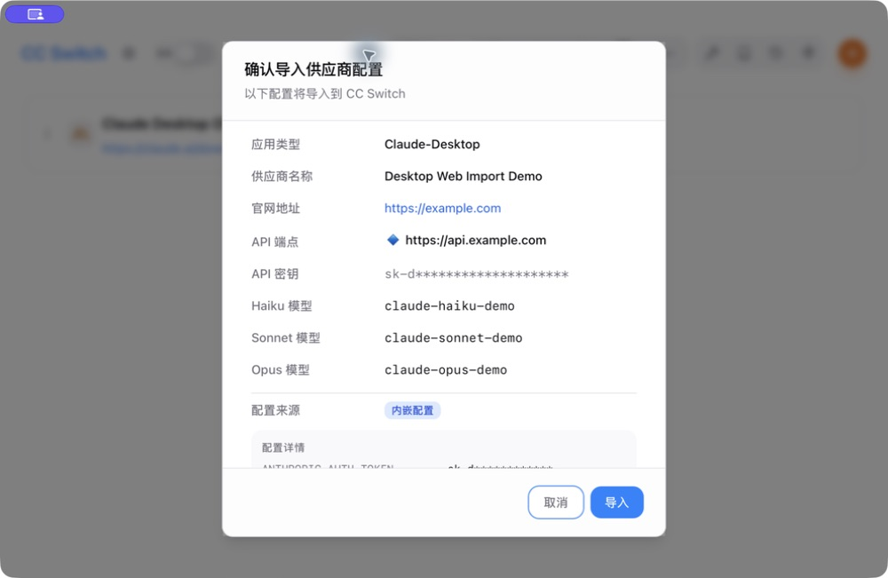
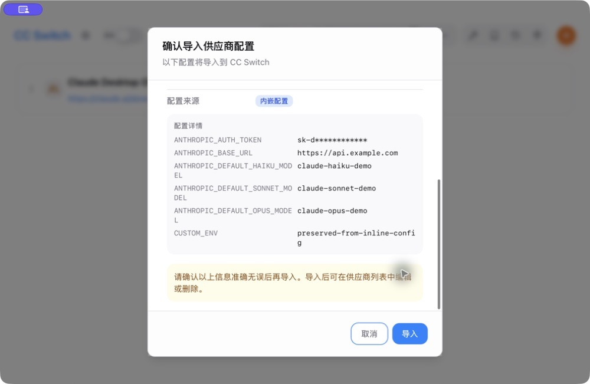
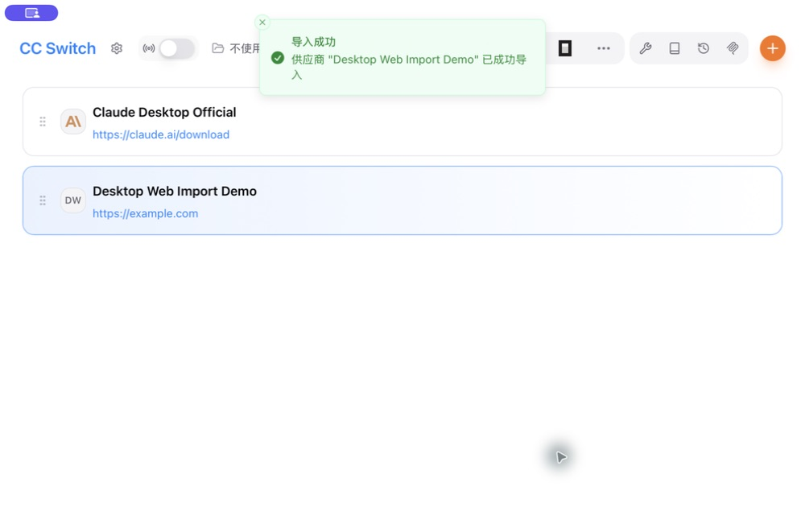

# PR #7587 — Manual desktop verification

- Source commit: `20323d0abc4290360ed9f90cd341f9a77e887656`.
- Platform: macOS; CC Switch 3.20.3 debug app built from the PR.
- Build-only overrides: product name `CC Switch PR 7587`, bundle identifier `com.ccswitch.pr7587verification`, updater artifacts disabled. No source changes for the verification build.
- Isolated data via the existing `CC_SWITCH_TEST_HOME` environment variable.
- URL delivery: macOS `open -a <verification app> <ccswitch URL>`. Default-browser protocol dispatch was not tested or changed, to preserve an existing pending import in the user's installed app.

## Observed results

1. A provider link using `app=claudedesktop` opened the actual Tauri import confirmation dialog and was normalized to Claude Desktop.
2. Haiku, Sonnet and Opus models from inline Base64 JSON appeared in the dialog.
3. The inline environment configuration appeared in the details panel, with the dummy API token masked and `CUSTOM_ENV` visible.
4. Clicking Import displayed a success notification and immediately refreshed the Claude Desktop provider list.
5. Read-only inspection of the isolated SQLite database confirmed the provider was stored under `claude-desktop`, metadata used `claudeDesktopMode=direct`, the URL API key overrode the inline API key, and `CUSTOM_ENV` was preserved.

Only dummy credentials and `api.example.com` were used. No live provider connectivity or inference was tested. `enabled=false` was supplied; the existing first-provider selection behavior may still mark the first imported provider current in a fresh profile.

## Screenshots

